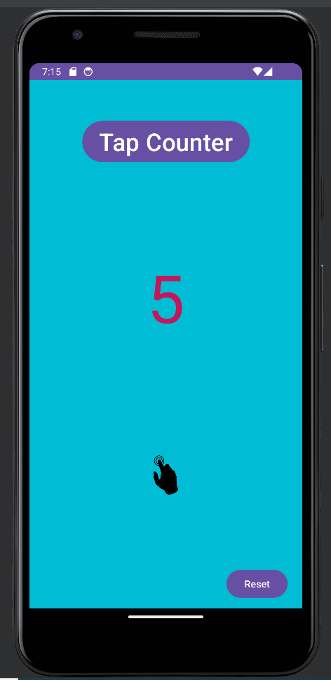
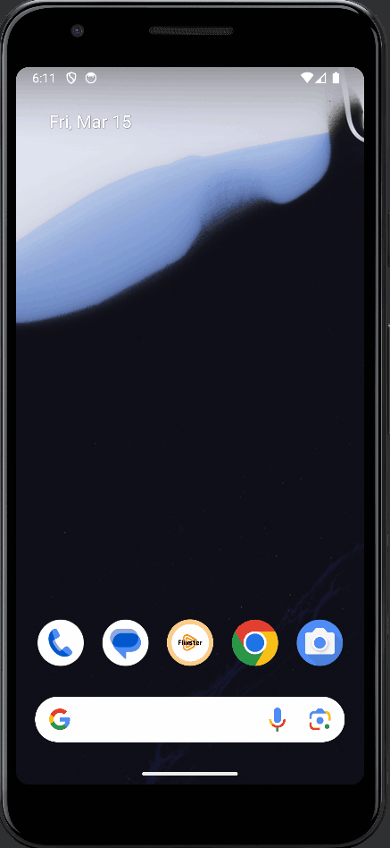
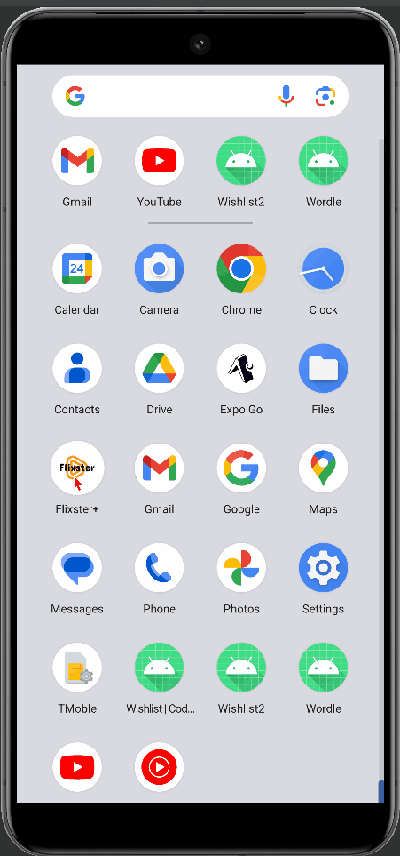

# Android App Development Course | [CodePath](https://www.codepath.org/)

## Overview

I enrolled in the [CodePath](https://www.codepath.org/) Intermediate Android App Development (AND 102) Course in February 2024! This course is designed to provide you with a comprehensive understanding of Android development using Kotlin and Android Studio. Below is an overview of the course structure, unit topics, and individual/group projects.

## Unit Structure

Each unit comprises 2 hours of in-class time, consisting of an interactive lesson and hands-on labs. Additionally, I will work on unit projects, ranging from individual app specifications to group projects in units 7-10. The estimated time for unit projects is 2-4 hours per unit, and they are asynchronous.

## Unit Topics

### Unit 1 - Kotlin and Android Studio | Feb 24 - March 2, 2024
- [x] **Interactive Lesson:** Introduction to Kotlin and Android Studio


<div style="float: left; width: 50%;color:yellow">

- [x] Labs: Tap Counter Game<br><br>
  <p align="left">
    
  </p>
</div>


<div style="float: left; width: 50%;position: relative;top:0px;color:yellow;">

- [x] Project: Wordle Game
<br><br>
  <p align="left">
    
  </p>
</div>


### Unit 2 - RecyclerView and Debugging | March 2 - March 9, 2024
- [x] **Interactive Lesson:** Understanding RecyclerView and Debugging in Android Studio


<div style="float: left; width: 50%;color:yellow">

- [x] Labs: Gmail Clone<br><br>
  <p align="left">
    
  </p>
</div>


<div style="float: left; width: 50%;position: relative;top:0px;color:yellow;">

- [x] Project: Wishlist App
<br><br>
  <p align="left">
    
  </p>
</div>


### Unit 3 - Using APIs and Image Loading
- [x] **Interactive Lesson:** Working with APIs


<div style="float: left; width: 50%;color:yellow">

- [x] Labs: NYT Book Search<br><br>
  <p align="left">
    
  </p>
</div>


<div style="float: left; width: 50%;position: relative;top:0px;color:yellow;">

- [x] Project: Flixster+ Part 1: Movies
<br><br>
  <p align="left">
    
  </p>
</div>


### Unit 4 - Advanced RecyclerView and Paging
- [ ] **Interactive Lesson:** Advanced RecyclerView Techniques


<div style="float: left; width: 50%;color:yellow">

- [ ] Labs: NYT Article Browser<br><br>
  <p align="left">
    
  </p>
</div>


<div style="float: left; width: 50%;position: relative;top:0px;color:yellow;">

- [x] Project: Flixster+ Part 2: Your Design
<br><br>
  <p align="left">
    
  </p>
</div>


### Unit 5 - Data Persistence
- [ ] **Interactive Lesson:** Data Persistence with Room and Shared Preferences

<div style="float: left; width: 50%;color:yellow">

- [ ] Labs: Data Persistence (TBA)<br><br>
  <p align="left">
    
  </p>
</div>


<div style="float: left; width: 50%;position: relative;top:0px;color:yellow;">

- [x] Project: BitFit Part 1
<br><br>
  <p align="left">
    
  </p>
</div>

### Unit 6 - Fragments and Navigation
- [ ] **Interactive Lesson:** Exploring Fragments and Navigation

<div style="float: left; width: 50%;color:yellow">
- [ ] Labs: NYT Combined App<br><br>
  <p align="left">
    
  </p>
</div>


<div style="float: left; width: 50%;position: relative;top:0px;color:yellow;">

- [ ] Project: BitFit Part 2
<br><br>
  <p align="left">
    
  </p>
</div>


## Final Project
### Unit 7-10 - Group Project


- [ ] **Sprint 1:** Planning (Product Specs and Wireframing)

- [ ] **Sprint 2:** Development

- [ ] **Sprint 3:** Development and Testing

- [ ] **Sprint 4:** Testing and Demo Day


## Individual App Projects

Each unit, I  will build an Android app to apply the concepts learned. The apps will take approximately 5-10 hours outside of class session times to complete.

## Labs

In labs, students will be guided through building apps to introduce new concepts in a hands-on environment. Labs include:

- **Idle Tap Game:** An app that counts the times a user taps on the screen.
- **Gmail Clone:** An app simulating a client for browsing a list of emails.
- **NY Times Lab Series:** A series of labs using the NY Times API to build out a functional book and article browsing app.

## How to Run

1. Clone this repository to your local machine.
   ```bash
   git clone https://github.com/mjafory/AND-102.git
