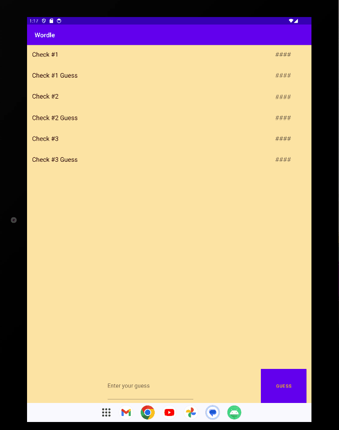

# Android Project Unit 1 | Project - Wordle Game

Submitted by: Magfur Jafory

Guess the World is an android app that recreates a simple version of the popular word game [Wordle](https://www.nytimes.com/games/wordle/index.html). 

Time spent: **20** hours spent in total

## Required Features

The following **required** functionality is completed:

- [x] **User has 3 chances to guess a random 4 letter word**
- [x] **After 3 guesses, user should no longer be able to submit another guess**
- [x] **After each guess, user sees the "correctness" of the guess**
- [x] **After all guesses are taken, user can see the target word displayed**

The following **optional** features are implemented:

- [ ] User can toggle betweeen different word lists
- [x] User can see the 'correctness' of their guess through colors on the word 
- [x] User sees a visual change after guessing the correct word
- [x] User can tap a 'Reset' button to get a new word and clear previous guesses
- [x] User will get an error message if they input an invalid guess
- [ ] User can see a 'streak' record of how many words they've guessed correctly.

The following **additional** features are implemented:

- [x] After getting a correct guess, user can have a little reward as conffeti after they pressed the button

## Video Walkthrough

Here's a walkthrough of implemented user stories:

This will be a regular walkthrough.

## Notes

Crafting the app proved challenging, particularly navigating through Kotlin syntax challenges and unexpected IDE errors. The configuration of confetti presented its own set of difficulties, yet the satisfaction of overcoming these obstacles made the journey worthwhile

## License

    Copyright [2022] [Thien Nguyen]

    Licensed under the Apache License, Version 2.0 (the "License");
    you may not use this file except in compliance with the License.
    You may obtain a copy of the License at

        http://www.apache.org/licenses/LICENSE-2.0

    Unless required by applicable law or agreed to in writing, software
    distributed under the License is distributed on an "AS IS" BASIS,
    WITHOUT WARRANTIES OR CONDITIONS OF ANY KIND, either express or implied.
    See the License for the specific language governing permissions and
    limitations under the License.
