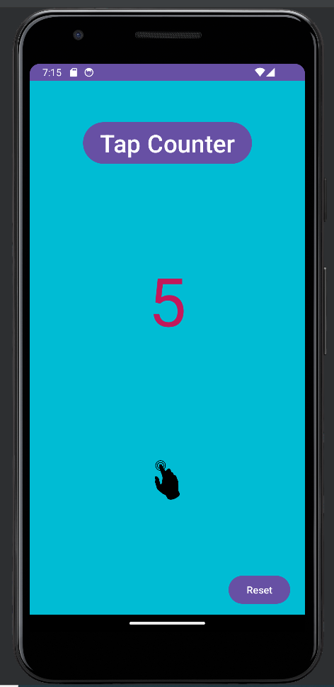

  

# Simple Counter App for AND102 | Intermediate Android Development | CodePath Unit 1 Lab

A simple counter app developed in Kotlin that tracks the number of times a user taps on a button. The app is designed to mimic the mechanics of popular idle tap mobile games.

## Overview

In this lab, the goal was to build a basic counter app using Kotlin, focusing on core features like user interaction, UI updates, and feedback mechanisms. The app displays a number on the screen that starts at 0, and users can tap a button to increment the displayed number by 1.

### Required Features

- User can see a number displayed on the screen. The number starts at 0.
- User can tap on a button to see the number displayed increase by 1.

### Stretch Features

The stretch features aim to enhance the app into an idle tap game with customizations and upgrades.

- **Exchange Taps for Upgrades:**
  - User can exchange 100 taps for an upgrade where each tap will count as 2 taps.
  - User can exchange 100 taps for an icon button instead of the standard one.

- **Customization:**
  - Customize the app with different themes, e.g., a dog background and a paw print button for a dog theme.

- **Challenge Mode (Extra Challenge):**
  - User has increasingly difficult goals to reach in terms of the number of taps accumulated.
  - Each goal is displayed on the screen until the next goal is reached.
  - Users can see how many goals they've reached in total.

### Prerequisites

- Android Studio installed
- Basic understanding of Kotlin programming language

