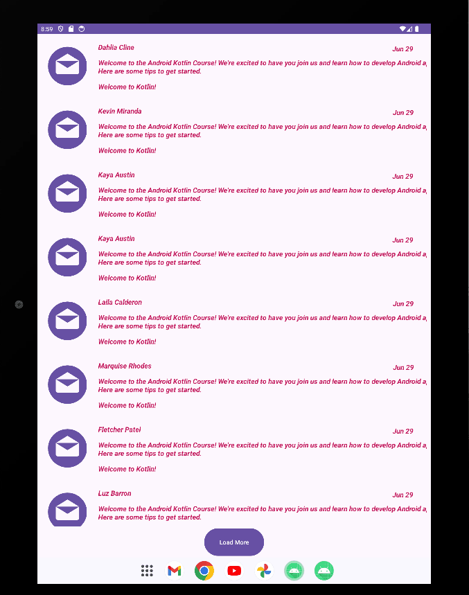

  

# RecyclerView Lab | AND 102: Intermediate Android Development | CodePath Unit 2 Lab

A simple counter app developed in Kotlin that tracks the number of times a user taps on a button. The app is designed to mimic the mechanics of popular idle tap mobile games.

## Overview

This lab focuses on building a RecyclerView in Android to display a list of emails. By the end of this lab, you will learn how to customize the UI for each item in the RecyclerView and implement additional features such as scrolling through emails and displaying sender pictures.

### Required Features

- User can scroll through a list of 10 emails.
- Each email includes the following information:
  - Sender
  - Email title
  - Email summary

### Stretch Features

- User can press a 'Load More' button to see the next 5 emails displayed.
- Each email displays additional information:
  - Picture of the sender
  - Email sent date
  - Bolded information if the email is unread

## Implementation Details

- The app uses a RecyclerView to display the list of emails.
- Each email item in the RecyclerView is customized to show the required information.
- The 'Load More' button triggers the display of the next 5 emails.
- Unread emails are visually distinguished, with additional information like sender pictures and sent dates.

