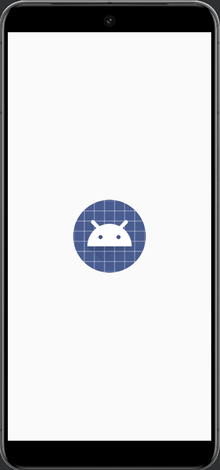

# Android Lab 3 - *Bestseller Books Showcase*

Submitted by: **Magfur Jafory**

**Bestseller Books Showcase** Explore the latest NY Times bestselling books with ease. Browse rankings, titles, authors, and descriptions conveniently displayed in a sleek app interface.

Time spent: **5** hours spent in total

## Required Features

Created an Android app to showcase NY Times bestselling books. Utilized AsyncHttpClient for API requests, Gson for JSON parsing, and Glide for image loading. Implemented RecyclerView to display book data with appropriate layout and styling. Enabled "Buy" button functionality to open Amazon listings. Overcame challenges with API key authentication and JSON parsing. Completed required features and implemented stretch goals for improved app appearance and functionality.

## Video Walkthrough

Here's a walkthrough of implemented user stories:

  

<!-- Replace this with whatever GIF tool you used! -->
GIF created with ...
<!-- Recommended tools:
[Kap](https://getkap.co/) for macOS
[ScreenToGif](https://www.screentogif.com/) for Windows
[peek](https://github.com/phw/peek) for Linux. -->

## Notes

Describe any challenges encountered while building the app.

## License

    Copyright [yyyy] [name of copyright owner]

    Licensed under the Apache License, Version 2.0 (the "License");
    you may not use this file except in compliance with the License.
    You may obtain a copy of the License at

        http://www.apache.org/licenses/LICENSE-2.0

    Unless required by applicable law or agreed to in writing, software
    distributed under the License is distributed on an "AS IS" BASIS,
    WITHOUT WARRANTIES OR CONDITIONS OF ANY KIND, either express or implied.
    See the License for the specific language governing permissions and
    limitations under the License.