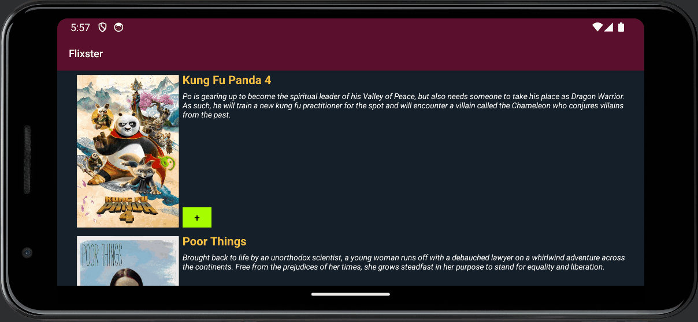

# Android Project 3 - *Flixster*

Submitted by: **Magfur Jafory**

**Flixster** is a movie browsing app that allows users to browse movies currently playing in theaters.

Time spent: **15** hours spent in total

## Required Features

The following **required** functionality is completed:

- [x] **Make a request to [The Movie Database API's `now_playing`](https://developers.themoviedb.org/3/movies/get-now-playing) endpoint to get a list of current movies**
- [x] **Parse through JSON data and implement a RecyclerView to display all movies**
- [x] **Use Glide to load and display movie poster images**

The following **optional** features are implemented:

- [x] Improve and customize the user interface through styling and coloring
- [x] Implement orientation responsivity
  - App should neatly arrange data in both landscape and portrait mode
- [x] Implement Glide to display placeholder graphics during loading
  - Note: this feature is difficult to capture in a GIF without throttling internet speeds.  Instead, include an additional screencap of your Glide code implementing the feature.  (<10 lines of code)

The following **additional** features are implemented:

- [x] List anything else that you can get done to improve the app functionality! 
  - Added log
  - Wishlist Button

## Video Walkthrough

Here's a walkthrough of implemented user stories:

  

  

<!-- Replace this with whatever GIF tool you used! -->
GIF created with ...
<!-- Recommended tools:
[Kap](https://getkap.co/) for macOS
[ScreenToGif](https://www.screentogif.com/) for Windows
[peek](https://github.com/phw/peek) for Linux. -->

## Notes

Describe any challenges encountered while building the app.

## License

    Copyright [yyyy] [name of copyright owner]

    Licensed under the Apache License, Version 2.0 (the "License");
    you may not use this file except in compliance with the License.
    You may obtain a copy of the License at

        http://www.apache.org/licenses/LICENSE-2.0

    Unless required by applicable law or agreed to in writing, software
    distributed under the License is distributed on an "AS IS" BASIS,
    WITHOUT WARRANTIES OR CONDITIONS OF ANY KIND, either express or implied.
    See the License for the specific language governing permissions and
    limitations under the License.