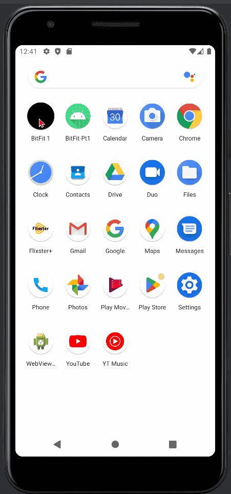

# Android Project 5 - *Bitfit 1*

Submitted by: **Magfur Jafory**

**Bit Fit 1** is your go-to health metrics companion, designed to effortlessly track your daily food intake and its corresponding calorie count. With its user-friendly interface and intuitive features, managing your dietary habits has never been easier. Stay on top of your nutritional goals and make informed choices about your diet, ensuring you maintain a balanced lifestyle. 

Time spent: **10** hours spent in total

## Required Features

The following **required** functionality is completed:

- [x] **At least one health metric is tracked (based on user input)**
  - Chosen metric(s): `[calories, time, food name]`
- [x] **There is a "create entry" UI that prompts users to make their daily entry**
- [x] **New entries are saved in a database and then updated in the RecyclerView**
- [ ] **On application restart, previously entered entries are preserved (i.e., are *persistent*)**
 
The following **optional** features are implemented:

- [ ] **Create a UI for tracking averages and trends in metrics**
- [x] **Improve and customize the user interface through styling and coloring**
- [ ] **Implement orientation responsivity**
- [ ] **Add a daily photo feature**

The following **additional** features are implemented:

- [x] Logo 
- [x] Reset Button 

## Video Walkthrough

Here's a walkthrough of implemented user stories:

  

<!-- Replace this with whatever GIF tool you used! -->
GIF created with ...
<!-- Recommended tools:
[Kap](https://getkap.co/) for macOS
[ScreenToGif](https://www.screentogif.com/) for Windows
[peek](https://github.com/phw/peek) for Linux. -->

## Notes

Challenges included handling asynchronous data retrieval and updating UI, designing responsive layouts, managing app navigation, and optimizing resource usage. Overcoming these required technical skills, problem-solving, and attention to detail for a robust app experience.

## License

    Copyright [yyyy] [name of copyright owner]

    Licensed under the Apache License, Version 2.0 (the "License");
    you may not use this file except in compliance with the License.
    You may obtain a copy of the License at

        http://www.apache.org/licenses/LICENSE-2.0

    Unless required by applicable law or agreed to in writing, software
    distributed under the License is distributed on an "AS IS" BASIS,
    WITHOUT WARRANTIES OR CONDITIONS OF ANY KIND, either express or implied.
    See the License for the specific language governing permissions and
    limitations under the License.